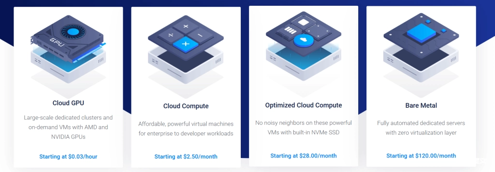

# Vultr用了这么久，终于可以聊聊真实体验了

我刚开始接触海外VPS那会儿，朋友推荐了Vultr——说是比DigitalOcean便宜、比Linode灵活。我当时也没想太多,就开了一台试试水。没想到这一用,就用到了现在。这几年建站、跑工具、测项目,基本都离不开它。Vultr给我最大的感觉就是"低调但靠谱"——不搞花哨功能,也不天天发广告,就靠稳定性和速度说话。如果你正在找一台能长期稳定跑项目的VPS,看完这篇基本就能决定要不要上车了。

---

## Vultr是个什么样的主机商

Vultr是做了很多年的海外云主机,走的是技术路线。最大的特点就是节点多、部署快、计费灵活。

全球二十多个机房随便挑,做跨境项目的话基本都能找到合适的位置放站。

它的控制台设计得挺简洁,新手看一眼就知道怎么操作,老用户批量开机也不费劲。镜像、快照、备份这些常用功能都有,遇到问题直接重装系统也不耽误事。

计费方式支持按小时算和包月,特别适合短期测试、搞活动站,也适合长期项目慢慢跑。整体给人的感觉就是稳定、不折腾、成本可控。

以上是常见参考价,最终还是要看下单页。我的建议是先开个小配置试跑一周,看看CPU、内存、带宽的实际使用情况再决定要不要升级,这样最省钱。

## 什么人适合用Vultr

如果你做外贸独立站、英文博客、联盟落地页,或者给全球用户提供小工具服务,Vultr都能快速上线。按小时计费这个设计真的很适合测试和短周期活动。

流量主要在亚洲的话,优先选新加坡、东京、首尔这几个节点;面向欧美用户就近选阿姆斯特丹、法兰克福、伦敦,或者芝加哥、达拉斯、洛杉矶,响应速度会更稳。

对I/O和数据库响应要求高的项目,优先选NVMe或者High Frequency系列;并发多、计算任务重的项目再考虑CPU Optimized,别一上来就堆高配浪费钱。

国内直连不太稳定是常态,建议全站接入CDN。静态资源丢到边缘节点,源站只处理动态请求,这样移动端打开速度能提升一大截。如果你想**快速部署全球化项目,又不想被复杂的配置搞晕头**,👉 [现在就去看看Vultr的机房选择和套餐配置](https://www.vultr.com/?ref=9738262-9J),找到最适合你项目的那一款。

---

## 用了这么久,说说Vultr到底值不值

如果你要全球节点、稳定网络、部署快,Vultr值得入手。它不是最便宜的,但整体稳,计费透明,长期用下来省心省事。

只有单站小流量也能从$5/月起步,等业务跑顺了再升级,不用一次性超配。流量主要在海外的项目,实际体验会更好。

如果主要面向国内用户,就老老实实配CDN和缓存。把静态资源丢到边缘节点,源站选近区机房,体验会稳定很多。

我的总体评价是:Vultr属于"性能不拖后腿、价格能接受、运维少操心"的那一档,适合长期项目持续使用。

### 推荐套餐

**入门建站或落地页:**Cloud Compute 1vCPU/1GB,$5/月起,低成本把站跑起来,后续看监控再升级。

**内容站或小型电商:**High Frequency/NVMe同档位,I/O和动态响应更快,后台操作更顺滑。

**脚本与并发任务:**CPU Optimized 2vCPU/4GB起,后续按负载加核加内存,避免早期浪费。

### 优惠码

优惠码:**VULTRMATCH**

### 类似品牌推荐

InterServer:月付友好、价格锁定,适合长期建站但不追求多节点的人群。

DigitalOcean:文档和生态好,面板顺手,价格略高,适合技术栈标准化的团队。

Hostinger:网络稳、口碑老牌,价格和Vultr接近,更多看个人习惯和节点覆盖。

---

## 性能测试数据,看看Vultr实际表现

### CPU和内存性能

常规Cloud Compute的单核性能稳定,多核扩展中规中矩;CPU Optimized在并行编译、批处理任务上更有优势。实际建站场景下(比如WordPress+缓存),1-2核就能稳定运行。

建议开启基本监控,观察CPU负载、内存水位、1分钟平均负载,持续一周后再决定是否升级规格,避免过配。

### 硬盘I/O读写

NVMe/High Frequency在随机读写和小文件场景下优势明显,数据库和后台操作更快;纯内容型或者静态居多的网站,常规SSD就足够了。

备份和快照功能简单好用。改动前先做快照,出问题一键回滚,线下维护压力小。

### 网络速度

就近机房下载速度可达Gbps级(取决于线路和所在城市),跨区访问会有自然时延,配CDN可以显著降低响应时间。

大文件传输建议避开高峰时段,或者使用分区同步方案,跨洲复制更稳。

### 丢包率和延迟

近区访问抖动低、延迟稳;跨洋链路主要看路径和运营商。Vultr骨干网络相对干净,绕路少,体验稳定。

面向亚洲用户优先新加坡/东京/首尔;欧美向按客户分布选阿姆斯特丹/法兰克福/伦敦或芝加哥/达拉斯/洛杉矶。

### 国内访问速度

直连波动大是常态,CDN基本是必选项。把静态资源前置到边缘,源站只处理动态请求,移动端首屏速度会明显改善。

后台SFTP/SSH建议在非高峰时段操作,或者走中转/加速通道,交互更顺滑。

### 使用体验和稳定性

面板简洁、创建和重装迅速、快照和备份顺手,适合多账户和批量化部署。小时计费让测试和活动站成本更可控。

带宽/流量口径清晰,成本可预测;遇到业务峰值也能临时加配,事后再降回正常规格。

| 优点 | 缺点 | 适合人群 |
|------|------|----------|
| 全球多机房,就近部署选择多 起价低、按小时计费,测试和活动站友好 NVMe/高频系列I/O和动态响应更快 面板简洁,快照/备份/镜像完善,易运维 | 国内直连不稳,强依赖CDN优化 高配价格不低,需要按需选型 老户折扣较少,活动偏新户向 | 跨境电商、外贸站、联盟落地页 需要多地区节点、快速试错的团队 要求稳定网络和可预测成本的长期项目 想"先小配验证,再平滑升级"的站长 |

---

## 常见问题

**1. 有哪些机房可选?**

全球二十多个城市可选,亚洲、欧美主流地区基本覆盖,下单页面会显示当前可用度和价格。

**2. 起步价和计费方式?**

Cloud Compute起价约$5/月,支持小时计费,用多少算多少,适合测试和短期活动。

**3. 选常规SSD还是NVMe?**

内容站或静态多的官网选常规SSD更划算;动态站、数据库压力大的项目优先NVMe/High Frequency。

**4. CPU Optimized适合什么?**

适合并发任务、编译/计算密集场景,价格更高,按需上车,别为"预期高负载"过配。

**5. 国内访问如何优化?**

必须配CDN,静态前置边缘,源站扛动态;后台操作尽量避开高峰,必要时用中转/加速方案。

**6. 迁移和升级是否麻烦?**

不麻烦。Vultr支持快照和变更规格,先做快照再升配,必要时换机房也能通过镜像快速恢复。

---

## 结语

用了这么久Vultr,最大的感受就是"稳定"和"省心"。它不是那种靠低价吸引人的主机,但长期用下来,性能稳定、计费透明、运维简单,确实省了不少麻烦。如果你正在找一台能长期跑项目的VPS,又不想被复杂配置和隐藏费用搞晕,👉 [点这里去Vultr看看](https://www.vultr.com/?ref=9738262-9J),它的全球节点覆盖和灵活计费方式,真的很适合跨境项目和长期建站。
